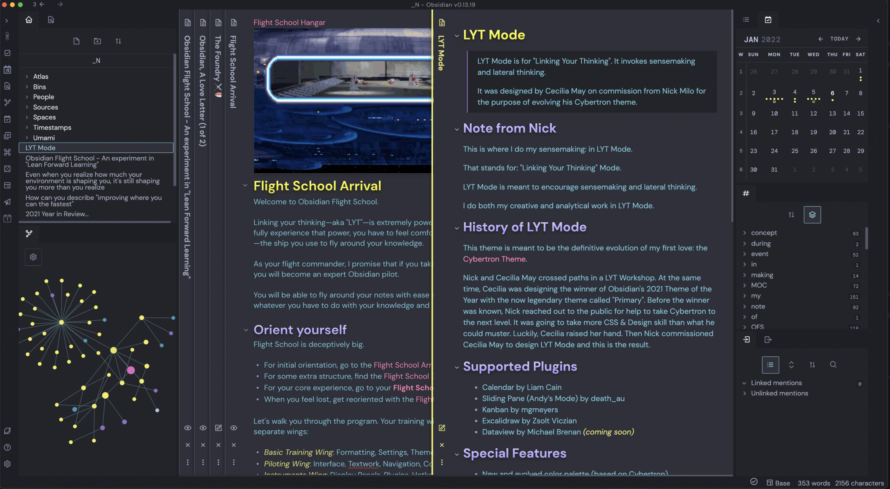

# LYT-Mode

LYT Mode is for "Linking Your Thinking". It invokes sensemaking and lateral thinking.

It was designed by Cecilia May on commission from Nick Milo for the purpose of evolving his Cybertron theme.

## Note from Nick

This is where I do my sensemaking: in LYT Mode.

That stands for: "Linking Your Thinking" Mode. 

LYT Mode is meant to encourage sensemaking and lateral thinking.

I do both my creative and analytical work in LYT Mode.

## History of LYT Mode

This theme is meant to be the definitive evolution of my first love: the [[Cybertron Theme]]. 

Nick and Cecilia May ( @ceciliamay ) crossed paths in a LYT Workshop. At the same time, Cecilia was designing the winner of Obsidian's 2021 Theme of the Year with the now legendary theme called "Primary". Before the winner was known, Nick reached out to the public for help to take Cybertron to the next level. It was going to take more CSS & Design skill than what he could muster. Luckily, Cecilia raised her hand. Then Nick commissioned Cecilia May to design LYT Mode and this is the result.

## Supported Plugins

- Calendar by Liam Cain  
- Sliding Pane (Andy’s Mode) by death_au  
- Kanban by mgmeyers  
- Excalidraw by Zsolt Viczian  
- Dataview by Michael Brenan _(coming soon)_

## Special Features

- New and evolved color palette (based on Cybertron).
- Featuring Avenir Next + DM Mono font combination (The classic LYT combo!)
- Works across all devices  
- Support for Legacy Editor and Live Preview.
- Custom icons  
- Completely custom interface design with delightful interactions  
- LYT Mode Syntax Highlighting  
- Special Color for each markdown emphasis:  
   - Purple for Bold  
   - Yellow for Italics  
   - White for Bold and Italics  
   - Gray for Strikethrough  
   - Gradient for Highlight  
   - Magenta for Links  
   - Green for Tags
   - Different Colored Headers
- Tighter sidebar item line-height to allow you to see more notes, tags, and links  
- Grayed out markdown formatting  
- Bigger Popovers  
- Support for Markdown Slides  
- Support for Publish _(coming soon)_
